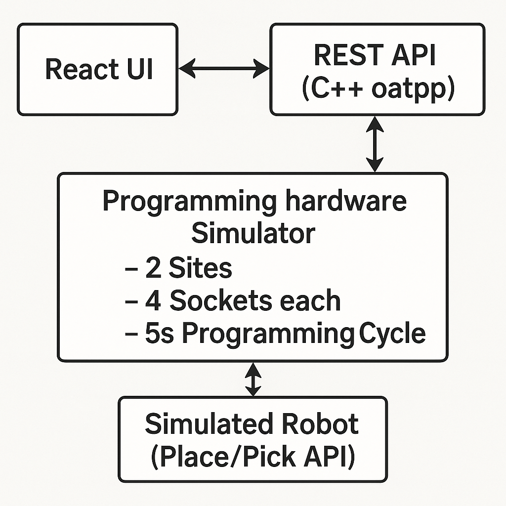

# BPM Programming System Integration (Technical Assessment)

This is a full-stack application built as part of a **technical assessment** for **BPM Microsystems**. The goal was to design and implement a simulation of an automated programming system that coordinates:

- Backend services (device state, job control)
- Frontend dashboard (real-time monitoring and control)
- Simulated robotic interactions (placing and picking devices)

---
## System Architecture

The following diagram summarizes the full-stack system design:


---
## Features

### Backend (C++ with OATPP)
- REST API for job management and socket programming
- Simulated programming cycle with pass/fail outcomes
- Modular design using adapters, DTOs, and controllers
- In-memory socket and job state tracking

### Frontend (React)
- Job control: Start, Stop, Pause, Resume
- Real-time socket status indicators
- Visual pass/fail results per device
- Job progress metrics and responsiveness

---

## System Workflow

1. Operator starts a job specifying number of devices
2. Robot places devices in available sockets via API
3. Programming starts automatically per full site (4 sockets)
4. After 5s, results (pass/fail) are recorded
5. Robot picks up completed devices
6. Dashboard updates live, process continues until job completes

---
## Getting Started

### Clone the Repository

```bash
git clone https://github.com/ashutoshspunyani99/prog-sys-int.git
cd prog-sys-int
```
---
## Project Structure

```
prog-sys-int/
├── backend/       # C++ backend using OATPP framework
├── frontend/      # React frontend dashboard
├── assets/        # Images and diagrams (e.g., architecture)
└── README.md
```

---

## Running the Project

### Backend
**Requirements:**
- CMake
- C++17+
- OATPP framework

```bash
cd backend
mkdir build && cd build
cmake ..
make
./prog-sys-int
```

### Frontend
**Requirements:**
- Node.js
- npm or yarn

```bash
cd frontend
npm install
npm start
```

---

## Key API Endpoints

 Method | Endpoint                             | Description                                |
|--------|--------------------------------------|--------------------------------------------|
| GET    | `/`                                  | Root endpoint (basic health check)         |
| POST   | `/api/job/start`                     | Start a new programming job                |
| POST   | `/api/job/stop`                      | Stop and reset the current job             |
| POST   | `/api/job/pause`                     | Pause the current job                      |
| POST   | `/api/job/resume`                    | Resume a paused job                        |
| GET    | `/api/job/status`                    | Get current job status                     |
| GET    | `/api/programming/sockets?siteId={site_id}`  | Get socket states for a given site         |
| GET    | `/api/robot/ready-to-place`          | Get list of available sockets for placement|
| GET    | `/api/robot/ready-to-pick`           | Get list of sockets ready for pickup       |
| POST   | `/api/robot/device-placed?socketId={socket_id}` | Confirm a device has been placed           |
| POST   | `/api/robot/device-picked?socketId={socket_id}` | Confirm a device has been picked           |
---


## Notes

- This simulation is designed to be **hardware-ready** — all logic could integrate with real-world robotics with minimal changes.
- Socket states and job flow are tracked in-memory but structured to be easily extendable to persistent storage.
